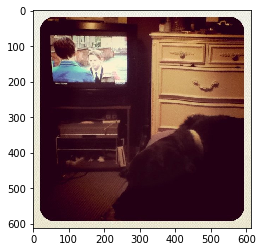
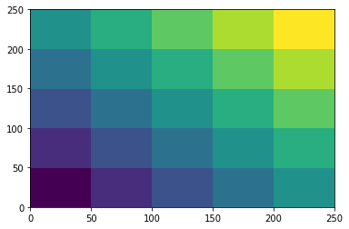
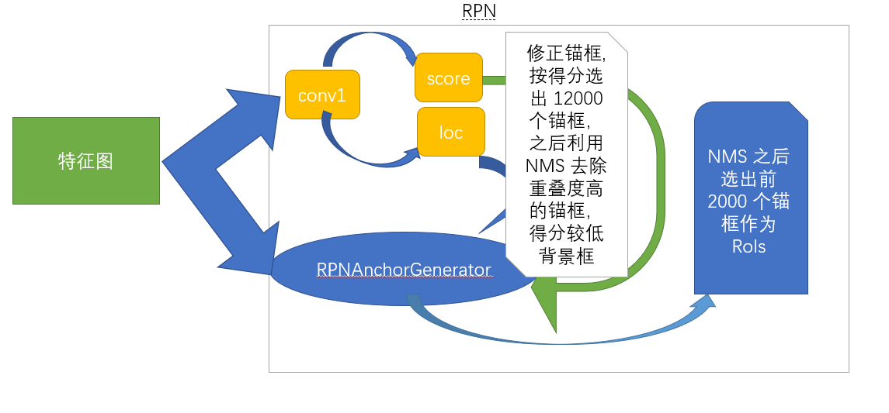

# Faster RCNN 学习与实现

- [论文](https://github.com/XinetAI/CVX/blob/master/%E7%9B%AE%E6%A0%87%E6%A3%80%E6%B5%8B/papers/Faster_R-CNN_2017.pdf)
- [论文翻译](https://www.jianshu.com/p/7adc34483e4a)

Faster R-CNN 主要分为两个部分：

- RPN（Region Proposal Network）生成高质量的 region proposal；
- Fast R-CNN 利用 region proposal 做出检测。

在论文中作者将 RPN 比作神经网络的**注意力机制**（"attention" mechanisms），告诉网络看哪里。为了更好的理解，下面简要的叙述论文的关键内容。

## RPN

- Input：任意尺寸的图像
- Output：一组带有目标得分的目标矩形 proposals

为了生成 region proposals，在基网络的最后一个卷积层 `x` 上滑动一个小网络。该小网络由一个 $3\times 3$ 卷积 `conv1` 和一对兄弟卷积（并行的）$1\times 1$ 卷积 `loc` 和 `score` 组成。其中，`conv1` 的参数 `padding=1`，`stride=1` 以保证其不会改变输出的特征图的尺寸。`loc` 作为 box-regression 用来编码 box 的坐标，`score` 作为 box-classifaction 用来编码每个 proposal 是目标的概率。详细内容见我的博客：[我的目标检测笔记](https://www.cnblogs.com/q735613050/p/10573794.html)。论文中把不同 scale 和 aspect ratio 的 $k$ 个 reference boxes（参数化的 proposal） 称作 **anchors**（锚点）。锚点是滑块的中心。

为了更好的理解 anchors，下面以 Python 来展示其内涵。

### 锚点

首先利用[COCO 数据集的使用](https://www.cnblogs.com/q735613050/p/8969452.html)中介绍的 API 来获取一张 COCO 数据集的图片及其标注。

先载入一些必备的包：

```python
import cv2
from matplotlib import pyplot as plt
import numpy as np

# 载入 coco 相关 api
import sys
sys.path.append(r'D:\API\cocoapi\PythonAPI')
from pycocotools.dataset import Loader
%matplotlib inline
```

利用 `Loader` 载入 val2017 数据集，并选择包含 'cat', 'dog', 'person' 的图片：

```python
dataType = 'val2017'
root = 'E:/Data/coco'
catNms = ['cat', 'dog', 'person']
annType = 'annotations_trainval2017'
loader = Loader(dataType, catNms, root, annType)
```

输出结果：

```sh
Loading json in memory ...
used time: 0.762376 s
Loading json in memory ...
creating index...
index created!
used time: 0.401951 s
```

可以看出，`Loader` 载入数据的速度很快。为了更加详细的查看 `loader`，下面打印出现一些相关信息：

```python
print(f'总共包含图片 {len(loader)} 张')
for i, ann in enumerate(loader.images):
    w, h = ann['height'], ann['width']
    print(f'第 {i+1} 张图片的高和宽分别为: {w, h}')
```

显示：

```sh
总共包含图片 2 张
第 1 张图片的高和宽分别为: (612, 612)
第 2 张图片的高和宽分别为: (500, 333)
```

下面以第 1 张图片为例来探讨 anchors。先可视化：

```python
img, labels = loader[0]
plt.imshow(img);
```

输出：



为了让特征图的尺寸大一点，可以将其 resize 为 (800, 800, 3)：

```python
img = cv2.resize(img, (800, 800))
print(img.shape)
```

输出：

```sh
(800, 800, 3)
```

下面借助 MXNet 来完成接下来的代码编程，为了适配 MXNet 需要将图片由 (h, w, 3) 转换为 (3, w, h) 形式。

```python
img = img.transpose(2, 1, 0)
print(img.shape)
```

输出：

```sh
(3, 800, 800)
```

由于卷积神经网络的输入是四维数据，故而，还需要：

```python
img = np.expand_dims(img, 0)
print(img.shape)
```

输出

```sh
(1, 3, 800, 800)
```

为了和论文一致，我们也采用 VGG16 网络（载入 [gluoncv](https://gluon-cv.mxnet.io/)中的权重）：

```python
from gluoncv.model_zoo import vgg16
net = vgg16(pretrained=True)  #  载入权重
```

仅仅考虑直至最后一层卷积层(去除池化层)的网络，下面查看网络的各个卷积层的输出情况：

```python
from mxnet import nd
imgs = nd.array(img)  # 转换为 mxnet 的数据类型
x = imgs
for layer in net.features[:29]:
    x = layer(x)
    if "conv" in layer.name:
        print(layer.name, x.shape) # 输出该卷积层的 shape
```

结果为：

```sh
vgg0_conv0 (1, 64, 800, 800)
vgg0_conv1 (1, 64, 800, 800)
vgg0_conv2 (1, 128, 400, 400)
vgg0_conv3 (1, 128, 400, 400)
vgg0_conv4 (1, 256, 200, 200)
vgg0_conv5 (1, 256, 200, 200)
vgg0_conv6 (1, 256, 200, 200)
vgg0_conv7 (1, 512, 100, 100)
vgg0_conv8 (1, 512, 100, 100)
vgg0_conv9 (1, 512, 100, 100)
vgg0_conv10 (1, 512, 50, 50)
vgg0_conv11 (1, 512, 50, 50)
vgg0_conv12 (1, 512, 50, 50)
```

由此，可以看出尺寸为 (800, 800) 的原图变为了 (50, 50) 的特征图（比原来缩小了 16 倍）。

### 感受野

上面的 16 不仅仅是针对尺寸为 (800, 800)，它适用于任意尺寸的图片，因为 16 是特征图的一个像素点的感受野（receptive field ）。

[^1]: Lenc K, Vedaldi A. R-CNN minus R.[J]. british machine vision conference, 2015.

感受野的大小是如何计算的？我们回忆卷积运算的过程，便可发现感受野的计算恰恰是卷积计算的逆过程（参考[感受野计算](papers/paper005.pdf)[^1]）。

记 $F_k, S_k, P_k$ 分别表示第 $k$ 层的卷积核的高(或者宽)、移动步长（stride）、Padding 个数；记 $i_k$ 表示第 $k$ 层的输出特征图的高（或者宽）。这样，很容易得出如下递推公式：

$$
i_{k+1} = \lfloor \frac{i_{k}-F_{k}+2P_{k}}{s_{k}}\rfloor + 1
$$

其中 $k \in \{1, 2, \cdots\}$，且 $i_0$ 表示原图的高或者宽。令 $t_k = \frac{F_k - 1}{2} - P_k$，上式可以转换为

$$
(i_{k-1} - 1) = (i_{k} - 1) S_k + 2t_k
$$

反推感受野, 令 $i_1 = F_1$, 且$t_k = \frac{F_k -1}{2} - P_k$, 且 $1\leq j \leq L$, 则有

$$
i_0 = (i_L - 1)\alpha_L + \beta_L
$$

其中 $\alpha_L = \prod_{p=1}^{L}S_p$，且有：

$$
\beta_L = 1 + 2\sum_{p=1}^L (\prod_{q=1}^{p-1}S_q) t_p
$$

由于 VGG16 的卷积核的配置均是 kernel_size=(3, 3), padding=(1, 1)，同时只有在经过池化层才使得 $S_j = 2$，故而 $\beta_j = 0$，且有 $\alpha_L = 2^4 = 16$。

### 锚点的计算

在编程实现的时候，将感受野的大小使用 `base_size` 来表示。下面我们讨论如何生成锚框？为了计算的方便，先定义一个 `Box`：

```python
import numpy as np

class Box:
    '''
    corner: Numpy, List, Tuple, MXNet.nd, rotch.tensor
    '''

    def __init__(self, corner):
        self._corner = corner

    @property
    def corner(self):
        return self._corner

    @corner.setter
    def corner(self, new_corner):
        self._corner = new_corner

    @property
    def w(self):
        '''
        计算 bbox 的 宽
        '''
        return self.corner[2] - self.corner[0] + 1

    @property
    def h(self):
        '''
        计算 bbox 的 高
        '''
        return self.corner[3] - self.corner[1] + 1

    @property
    def area(self):
        '''
        计算 bbox 的 面积
        '''
        return self.w * self.h

    @property
    def whctrs(self):
        '''
        计算 bbox 的 中心坐标
        '''
        assert isinstance(self.w, (int, float)), 'need int or float'
        xctr = self.corner[0] + (self.w - 1) * .5
        yctr = self.corner[1] + (self.h - 1) * .5
        return xctr, yctr

    def __and__(self, other):
        '''
        运算符：&，实现两个 box 的交集运算
        '''
        xmin = max(self.corner[0], other.corner[0])  # xmin 中的大者
        xmax = min(self.corner[2], other.corner[2])  # xmax 中的小者
        ymin = max(self.corner[1], other.corner[1])  # ymin 中的大者
        ymax = min(self.corner[3], other.corner[3])  # ymax 中的小者
        w = xmax - xmin
        h = ymax - ymin
        if w < 0 or h < 0: # 两个边界框没有交集
            return 0
        else:  
            return w * h

    def __or__(self, other):
        '''
        运算符：|，实现两个 box 的并集运算
        '''
        I = self & other
        if I == 0:
            return 0
        else:
            return self.area + other.area - I

    def IoU(self, other):
        '''
        计算 IoU
        '''
        I = self & other
        if I == 0:
            return 0
        else:
            U = self | other
            return I / U
```

类 Box 实现了 bbox 的交集、并集运算以及 IoU 的计算。下面举一个例子来说明：

```python
bbox = [0, 0, 15, 15]  # 边界框
bbox1 = [5, 5, 12, 12] # 边界框
A = Box(bbox)  # 一个 bbox 实例
B = Box(bbox1) # 一个 bbox 实例
```

下面便可以输出 A 与 B 的高宽、中心、面积、交集、并集、Iou：

```python
print('A 与 B 的交集', str(A & B))
print('A 与 B 的并集', str(A | B))
print('A 与 B 的 IoU', str(A.IoU(B)))
print('A 的中心、高、宽以及面积', str(A.whctrs), A.h, A.w, A.area)
```

输出结果：

```sh
A 与 B 的交集 49
A 与 B 的并集 271
A 与 B 的 IoU 0.18081180811808117
A 的中心、高、宽以及面积 (7.5, 7.5) 16 16 256
```

考虑到代码的可复用性，将 `Box` 封装进入 app/detection/bbox.py 中。下面重新考虑 loader。首先定义一个转换函数：

```python
def getX(img):
    # 将 img (h, w, 3) 转换为 (1, 3, w, h)
    img = img.transpose((2, 1, 0))
    return np.expand_dims(img, 0)
```

函数 `getX` 将图片由 (h, w, 3) 转换为 (1, 3, w, h)：

```python
img, label = loader[0]
img = cv2.resize(img, (800, 800)) # resize 为 800 x 800
X = getX(img)     # 转换为 (1, 3, w, h)
img.shape, X.shape
```

输出结果：

```sh
((800, 800, 3), (1, 3, 800, 800))
```

与此同时，获取特征图的数据：

```python
features = net.features[:29]
F = features(imgs)
F.shape
```

输出：

```sh
(1, 512, 50, 50)
```

接着需要考虑如何将特征图 F 映射回原图？

### 全卷积（FCN）：将锚点映射回原图

faster R-CNN 中的 FCN 仅仅是有着 FCN 的特性，并不是真正意义上的卷积。faster R-CNN 仅仅是借用了 FCN 的思想来实现将特征图映射回原图的目的，同时将输出许多锚框。

特征图上的 1 个像素点的感受野为 $16\times 16$，换言之，特征图上的锚点映射回原图的感受区域为 $16 \times 16$，论文称其为 reference box。下面相对于 reference box 依据不同的尺度与高宽比例来生成不同的锚框。

```python
base_size = 2**4  # 特征图的每个像素的感受野大小
scales = [8, 16, 32]  # 锚框相对于 reference box 的尺度
ratios = [0.5, 1, 2]  # reference box 与锚框的高宽的比率（aspect ratios）
```

其实 reference box 也对应于论文描述的 window（滑动窗口），这个之后再解释。我们先看看 scales 与 ratios 的具体含义。

为了更加一般化，假设 reference box 图片高宽分别为 $h, w$，而锚框的高宽分别为 $h_1, w_1$，形式化 scales 与 ratios 为公式 1：

$$
\begin{cases}
\frac{w_1 h_1}{wh} = s^2\\
\frac{h_1}{w_1} = \frac{h}{w} r \Rightarrow \frac{h_1}{h} = \frac{w_1}{w} r
\end{cases}
$$

可以将上式转换为公式 2：

$$
\begin{cases}
\frac{w_1}{w} = \frac{s}{\sqrt{r}}\\
\frac{h_1}{h} = \frac{w_1}{w} r = s \sqrt{r}
\end{cases}
$$

同样可以转换为公式3：

$$
\begin{cases}
w_s = \frac{w_1}{s} = \frac{w}{\sqrt{r}}\\
h_s = \frac{h_1}{s} = h \sqrt{r}
\end{cases}
$$

基于公式 2 与公式 3 均可以很容易计算出 $w_1,h_1$. 一般地，$w=h$，公式 3 亦可以转换为公式 4：

$$
\begin{cases}
w_s = \sqrt{\frac{wh}{r}}\\
h_s = w_s r
\end{cases}
$$

gluoncv 结合公式 4 来编程，本文依据 3 进行编程。无论原图的尺寸如何，特征图的左上角第一个锚点映射回原图后的 reference box 的 bbox = (xmain, ymin, xmax, ymax) 均为 (0, 0, bas_size-1, base_size-1)，为了方便称呼，我们称其为 base_reference box。基于 base_reference box 依据不同的 s 与 r 的组合生成不同尺度和高宽比的锚框，且称其为 base_anchors。编程实现：

```python
class MultiBox(Box):
    def __init__(self, base_size, ratios, scales):
        if not base_size:
            raise ValueError("Invalid base_size: {}.".format(base_size))
        if not isinstance(ratios, (tuple, list)):
            ratios = [ratios]
        if not isinstance(scales, (tuple, list)):
            scales = [scales]
        super().__init__([0]*2+[base_size-1]*2)  # 特征图的每个像素的感受野大小为 base_size
        # reference box 与锚框的高宽的比率（aspect ratios）
        self._ratios = np.array(ratios)[:, None]
        self._scales = np.array(scales)     # 锚框相对于 reference box 的尺度

    @property
    def base_anchors(self):
        ws = np.round(self.w / np.sqrt(self._ratios))
        w = ws * self._scales
        h = w * self._ratios
        wh = np.stack([w.flatten(), h.flatten()], axis=1)
        wh = (wh - 1) * .5
        return np.concatenate([self.whctrs - wh, self.whctrs + wh], axis=1)

    def _generate_anchors(self, stride, alloc_size):
        # propagete to all locations by shifting offsets
        height, width = alloc_size  # 特征图的尺寸
        offset_x = np.arange(0, width * stride, stride)
        offset_y = np.arange(0, height * stride, stride)
        offset_x, offset_y = np.meshgrid(offset_x, offset_y)
        offsets = np.stack((offset_x.ravel(), offset_y.ravel(),
                            offset_x.ravel(), offset_y.ravel()), axis=1)
        # broadcast_add (1, N, 4) + (M, 1, 4)
        anchors = (self.base_anchors.reshape(
            (1, -1, 4)) + offsets.reshape((-1, 1, 4)))
        anchors = anchors.reshape((1, 1, height, width, -1)).astype(np.float32)
        return anchors
```

下面看看具体效果：

```python
base_size = 2**4  # 特征图的每个像素的感受野大小
scales = [8, 16, 32]  # 锚框相对于 reference box 的尺度
ratios = [0.5, 1, 2]  # reference box 与锚框的高宽的比率（aspect ratios）
A = MultiBox(base_size,ratios, scales)
A.base_anchors
```

输出结果：

```python
array([[ -84.,  -38.,   99.,   53.],
       [-176.,  -84.,  191.,   99.],
       [-360., -176.,  375.,  191.],
       [ -56.,  -56.,   71.,   71.],
       [-120., -120.,  135.,  135.],
       [-248., -248.,  263.,  263.],
       [ -36.,  -80.,   51.,   95.],
       [ -80., -168.,   95.,  183.],
       [-168., -344.,  183.,  359.]])
```

接着考虑将 base_anchors 在整个原图上进行滑动。比如，特征图的尺寸为 (5， 5) 而感受野的大小为 50，则 base_reference box 在原图滑动的情况（移动步长为 50）如下图：

```python
x, y = np.mgrid[0:300:50, 0:300:50]
plt.pcolor(x, y, x+y);  # x和y是网格,z是(x,y)坐标处的颜色值colorbar()
```

输出结果：



原图被划分为了 25 个 block，每个 block 均代表一个 reference box。若 base_anchors 有 9 个，则只需要按照 stride = 50 进行滑动便可以获得这 25 个 block 的所有锚框（总计 5x5x9=225 个）。针对前面的特征图 F 有：

```python
stride = 16  # 滑动的步长
alloc_size = F.shape[2:]  # 特征图的尺寸
anchors = A._generate_anchors(stride, alloc_size).shape
```

输出结果：

```sh
(1, 1, 50, 50, 36)
```

即总共 $50\times 50 \times 9=22500$ 个锚点（anchors 数量庞大且必然有许多的高度重叠的框。）。至此，我们生成初始锚框的过程便结束了，同时很容易发现，anchors 的生成仅仅借助 Numpy 便完成了，这样做十分有利于代码迁移到 Pytorch、TensorFlow 等支持 Numpy 作为输入的框架。下面仅仅考虑 MXNet，其他框架以后再讨论。下面先看看 MultiBox 的设计对于使用 MXNet 进行后续的开发有什么好处吧！

由于 base-net （基网络）的结构一经确定便是是固定的，针对不同尺寸的图片，如果每次生成 anchors 都要重新调用 A._generate_anchors() 一次，那么将会产生很多的不必要的冗余计算，gluoncv 提供了一种十分不错的思路：先生成 base_anchors，然后选择一个比较大的尺度 alloc_size（比如 $128\times 128$）用来生成锚框的初选模板；接着把真正的特征图传入到 RPNAnchorGenerator 并通过前向传播计算得到特征图的锚框。具体的操作细节见如下代码：

```python
class RPNAnchorGenerator(gluon.HybridBlock):
    r"""生成 RPN 的锚框

    参数
    ----------
    stride : int
        特征图相对于原图的滑动步长，或是说是特征图上单个像素点的感受野。
    base_size : int
        reference anchor box 的宽或者高
    ratios : iterable of float
        anchor boxes 的 aspect ratios（高宽比）。我们期望它是 tuple 或者 list
    scales : iterable of float
        锚框相对于 reference anchor boxes 的尺度
        采用如下形式计算锚框的高和宽:

        .. math::

            width_{anchor} = size_{base} \times scale \times \sqrt{ 1 / ratio}
            height_{anchor} = width_{anchor} \times ratio

    alloc_size : tuple of int
        预设锚框的尺寸为 (H, W)，通常用来生成比较大的特征图（如 128x128）。
        在推断的后期, 我们可以有可变的输入大小, 在这个时候, 我们可以从这个大的 anchor map 中直接裁剪出对应的 anchors, 以便我们可以避免在每次输入都要重新生成锚点。
    """

    def __init__(self, alloc_size, base_size, ratios, scales, **kwargs):
        super().__init__(**kwargs)
        # 生成锚框初选模板，之后通过切片获取特征图的真正锚框
        anchors = MultiBox(base_size, ratios, scales)._generate_anchors(
            base_size, alloc_size)
        self.anchors = self.params.get_constant('anchor_', anchors)

    # pylint: disable=arguments-differ
    def hybrid_forward(self, F, x, anchors):
        """Slice anchors given the input image shape.

        Inputs:
            - **x**: input tensor with (1 x C x H x W) shape.
        Outputs:
            - **out**: output anchor with (1, N, 4) shape. N is the number of anchors.

        """
        a = F.slice_like(anchors, x * 0, axes=(2, 3))
        return a.reshape((1, -1, 4))
```

上面的 RPNAnchorGenerator 直接改写自 gluoncv。看看 RPNAnchorGenerator 的魅力所在：

```python
base_size = 2**4  # 特征图的每个像素的感受野大小
scales = [8, 16, 32]  # 锚框相对于 reference box 的尺度
ratios = [0.5, 1, 2]  # reference box 与锚框的高宽的比率（aspect ratios）
stride = base_size  # 在原图上滑动的步长
alloc_size = (128, 128)  # 一个比较大的特征图的锚框生成模板
# 调用 RPNAnchorGenerator 生成 anchors
A = RPNAnchorGenerator(alloc_size, base_size, ratios, scales)
A.initialize()
A(F)  # 直接传入特征图 F，获取 F 的 anchors
```

输出结果：

```sh
[[[ -84.  -38.   99.   53.]
  [-176.  -84.  191.   99.]
  [-360. -176.  375.  191.]
  ...
  [ 748.  704.  835.  879.]
  [ 704.  616.  879.  967.]
  [ 616.  440.  967. 1143.]]]
<NDArray 1x22500x4 @cpu(0)>
```

shape = 1x22500x4 符合我们的预期。如果我们更改特征图的尺寸：

```python
x = nd.zeros((1, 3, 75, 45))
A(x).shape
```

输出结果：

```python
(1, 30375, 4)
```

这里 $30375 = 75 \times 45 \times 9$ 也符合我们的预期。

至此，我们完成了将特征图上的所有锚点映射回原图生成锚框的工作！

## 平移不变性的锚点

反观上述的编程实现，很容易便可理解论文提到的锚点的平移不变性。无论是锚点的生成还是锚框的生成都是基于 base_reference box 进行平移和卷积运算（亦可看作是一种线性变换）的。为了叙述方便下文将 RPNAnchorGenerator（被放置在 app/detection/anchor.py） 生成的 anchor boxes 由 corner（记作 $A$ 坐标形式：(xmin,ymin,xmax,ymax)）转换为 center（形式为：(xctr,yctr,w,h)）后的锚框记作 $B$。其中(xmin,ymin),(xmax,ymax) 分别表示锚框的最小值与最大值坐标；(xctr,yctr) 表示锚框的中心坐标，w,h 表示锚框的宽和高。且记 $a = (x_a,y_a,w_a,h_a) \in B$，即使用下标 $a$ 来标识锚框。$A$ 与 $B$ 是锚框的两种不同的表示形式。

在 `gluoncv.nn.bbox` 中提供了将 $A$ 转换为 $B$ 的模块：`BBoxCornerToCenter`。下面便利用其进行编程。先载入环境：

```python
cd ../app/
```

接着载入本小节所需的包：

```python
from mxnet import init, gluon, autograd
from mxnet.gluon import nn
from gluoncv.nn.bbox import BBoxCornerToCenter
# 自定义包
from detection.bbox import MultiBox
from detection.anchor import RPNAnchorGenerator
```

为了更加容易理解 $A$ 与 $B$ 的处理过程，下面先自创一个类(之后会抛弃)：

```python
class RPNProposal(nn.HybridBlock):
    def __init__(self, channels, stride, base_size, ratios, scales, alloc_size, **kwargs):
        super().__init__(**kwargs)
        weight_initializer = init.Normal(0.01)

        with self.name_scope():
            self.anchor_generator = RPNAnchorGenerator(
                stride, base_size, ratios, scales, alloc_size)
            anchor_depth = self.anchor_generator.num_depth
            # conv1 的创建
            self.conv1 = nn.HybridSequential()
            self.conv1.add(nn.Conv2D(channels, 3, 1, 1,
                                     weight_initializer=weight_initializer))
            self.conv1.add(nn.Activation('relu'))
            # score 的创建
            # use sigmoid instead of softmax, reduce channel numbers
            self.score = nn.Conv2D(anchor_depth, 1, 1, 0,
                                   weight_initializer=weight_initializer)
            # loc 的创建
            self.loc = nn.Conv2D(anchor_depth * 4, 1, 1, 0,
                                 weight_initializer=weight_initializer)
# 具体的操作如下
channels = 256
base_size = 2**4  # 特征图的每个像素的感受野大小
scales = [8, 16, 32]  # 锚框相对于 reference box 的尺度
ratios = [0.5, 1, 2]  # reference box 与锚框的高宽的比率（aspect ratios）
stride = base_size  # 在原图上滑动的步长
alloc_size = (128, 128)  # 一个比较大的特征图的锚框生成模板
alloc_size = (128, 128)  # 一个比较大的特征图的锚框生成模板
self = RPNProposal(channels, stride, base_size, ratios, scales, alloc_size)
self.initialize()
```

下面我们便可以看看如何将 $A$ 转换为 $B$：

```python
img, label = loader[0]  # 载入图片和标注信息
img = cv2.resize(img, (800, 800))  # resize 为 (800，800)
imgs = nd.array(getX(img))  # 转换为 MXNet 的输入形式
xs = features(imgs)        # 获取特征图张量
F = nd
A = self.anchor_generator(xs)    # (xmin,ymin,xmax,ymax) 形式的锚框
box_to_center = BBoxCornerToCenter()  
B = box_to_center(A)      # (x,y,w,h) 形式的锚框
```

### 边界框回归

手动设计的锚框 $B$ 并不能很好的满足后续的 Fast R-CNN 的检测工作，还需要借助论文介绍的 3 个卷积层：conv1、score、loc。对于论文中的 $3 \times 3$ 的卷积核 conv1 我的理解是**模拟锚框的生成过程：通过不改变原图尺寸的卷积运算达到降维的目标，同时有着在原图滑动尺寸为 base_size 的 reference box 的作用**。换言之，**conv1 的作用是模拟生成锚点**。假设通过 RPN 生成的边界框 bbox 记为 $G=\{p:(x,y,w,h)\}$，利用 $1\times 1$ 卷积核 loc 预测 $p$ 相对于每个像素点（即锚点）所生成的 $k$ 个锚框的中心坐标与高宽的**偏移量**，利用 $1\times 1$ 卷积核 score 判别锚框是目标（objectness, foreground）还是背景（background）。记真实的边界框集合为 $G^* = \{p^*：(x^*,y^*,w^*,h^*)\}$。其中，$(x,y), (x^*,y^*)$ 分别代表预测边界框、真实边界框的中心坐标；$(w, h)， (w^*, h^*)$ 分别代表预测边界框、真实边界框的的宽与高。论文在 Training RPNs 中提到，在训练阶段 conv1、loc、score 使用均值为 $0$，标准差为 $0.01$ 的高斯分布来随机初始化。
接着，看看如何使用 conv1、loc、score：

```python
x = self.conv1(xs)
# score 的输出
raw_rpn_scores = self.score(x).transpose(axes=(0, 2, 3, 1)).reshape((0, -1,1))
rpn_scores = F.sigmoid(F.stop_gradient(raw_rpn_scores)) # 转换为概率形式
# loc 的输出
rpn_box_pred = self.loc(x).transpose(axes=(0, 2, 3, 1)).reshape((0, -1, 4))
```

卷积核 loc 的作用是用来学习偏移量的，在论文中给出了如下公式：

$$
\begin{cases}
t_x = \frac{x - x_a}{w_a} & t_y = \frac{y - y_a}{h_a}\\
t_x^* = \frac{x^* - x_a}{w_a} & t_y^* = \frac{y^* - y_a}{h_a}\\
t_w = \log(\frac{w}{w_a}) & t_h = \log(\frac{h}{h_a})\\
t_w^* = \log(\frac{w^*}{w_a}) & t_h^* = \log(\frac{h^*}{h_a})
\end{cases}
$$

这样可以很好的消除图像尺寸的不同带来的影响。为了使得修正后的锚框 G 具备与真实边界框 $G^*$ 有相同的均值和标准差，还需要设定：$\sigma = (\sigma_x, \sigma_y, \sigma_w, \sigma_h), \mu = (\mu_x,\mu_y,\mu_w,\mu_h)$ 表示 G 的 (x, y, w, h) 对应的标准差与均值。故而，为了让预测的边界框的的偏移量的分布更加均匀还需要将坐标转换一下：

$$
\begin{cases}
t_x = \frac{\frac{x - x_a}{w_a} - \mu_x}{\sigma_x}\\
t_y = \frac{\frac{y - y_a}{h_a} - \mu_y}{\sigma_y}\\
t_w = \frac{\log(\frac{w}{w_a}) - \mu_w}{\sigma_w}\\
t_h = \frac{\log(\frac{h}{h_a}) - \mu_h}{\sigma_h}
\end{cases}
$$

对于 $G^*$ 也是一样的操作。（略去）一般地，$\sigma = (0.1, 0.1, 0.2, 0.2), \mu = (0, 0, 0, 0)$。

由于 loc 的输出便是 $\{(t_x, t_y, t_w, t_h)\}$，下面我们需要反推 $(x, y, w, h)$：

$$
\begin{cases}
x = (t_x\sigma_x +\mu_x)w_a + x_a\\
y = (t_y\sigma_y +\mu_x)h_a + y_a\\
w = w_a e^{t_w\sigma_w + \mu_w}\\
h = h_a e^{t_h\sigma_h + \mu_h}
\end{cases}
$$

通常情况下，$A$ 形式的边界框转换为 $B$ 形式的边界框被称为**编码**（encode），反之，则称为**解码**（decode）。在 `gluoncv.nn.coder` 中的 `NormalizedBoxCenterDecoder` 类实现了上述的转换过程，同时也完成了 $G$ 解码工作。

```python
from gluoncv.nn.coder import NormalizedBoxCenterDecoder
stds = (0.1, 0.1, 0.2, 0.2)
means = (0., 0., 0., 0.)
box_decoder = NormalizedBoxCenterDecoder(stds, means)
roi = box_decoder(rpn_box_pred, B)  # 解码后的 G
```

### 裁剪预测边界框超出原图边界的边界

为了保持一致性，需要重写 `getX`：

```python
def getX(img):
    # 将 img (h, w, 3) 转换为 (1, 3, h, w)
    img = img.transpose((2, 0, 1))
    return np.expand_dims(img, 0)
```

考虑到 RPN 的输入可以是批量数据：

```python
imgs = []
labels = []
for img, label in loader:
    img = cv2.resize(img, (600, 800))  # resize 宽高为 (600，800)
    imgs.append(getX(img))
    labels.append(label)
imgs = nd.array(np.concatenate(imgs)) # 一个批量的图片
labels = nd.array(np.stack(labels))  # 一个批量的标注信息
```

这样便有：

```python
from gluoncv.nn.coder import NormalizedBoxCenterDecoder
from gluoncv.nn.bbox import BBoxCornerToCenter
stds = (0.1, 0.1, 0.2, 0.2)
means = (0., 0., 0., 0.)

fs = features(imgs)        # 获取特征图张量
F = nd
A = self.anchor_generator(fs)    # (xmin,ymin,xmax,ymax) 形式的锚框
box_to_center = BBoxCornerToCenter()  
B = box_to_center(A)      # (x,y,w,h) 形式的锚框
x = self.conv1(fs)    # conv1 卷积
raw_rpn_scores = self.score(x).transpose(axes=(0, 2, 3, 1)).reshape((0, -1,1))  # 激活之前的 score
rpn_scores = F.sigmoid(F.stop_gradient(raw_rpn_scores))    # 激活后的 score
rpn_box_pred = self.loc(x).transpose(axes=(0, 2, 3, 1)).reshape((0, -1, 4))  # loc 预测偏移量 (tx,ty,tw,yh)
box_decoder = NormalizedBoxCenterDecoder(stds, means)
roi = box_decoder(rpn_box_pred, B)  # 解码后的 G
print(roi.shape)
```

此时，便有两张图片的预测 G：

```sh
(2, 16650, 4)
```

因为此时生成的 RoI 有许多超出边界的框，所以，需要进行裁减操作。先裁剪掉所有小于 $0$ 的边界：

```python
x = F.maximum(roi, 0.0)
```

`nd.maximum(x)` 的作用是 $\max\{0, x\}$。接下来裁剪掉大于原图的边界的边界：

```python
shape = F.shape_array(imgs)  # imgs 的 shape
size = shape.slice_axis(axis=0, begin=2, end=None)  # imgs 的尺寸
window = size.expand_dims(0)
window
```

输出结果：

```python
[[800 600]]
<NDArray 1x2 @cpu(0)>
```

此时是 (高, 宽) 的形式，而锚框的是以  (宽, 高) 的形式生成的，故而还需要：

```python
F.reverse(window, axis=1)
```

结果：

```python
[[600 800]]
<NDArray 1x2 @cpu(0)>
```

因而，下面的 `m` 可以用来判断是否超出边界：

```python
m = F.tile(F.reverse(window, axis=1), reps=(2,)).reshape((0, -4, 1, -1))
m
```

结果：

```python
[[[600 800 600 800]]]
<NDArray 1x1x4 @cpu(0)>
```

接着，便可以获取裁剪之后的 RoI：

```python
roi = F.broadcast_minimum(x, F.cast(m, dtype='float32'))
```

整个裁剪工作可以通过如下操作简单实现：

```python
from gluoncv.nn.bbox import BBoxClipToImage
clipper = BBoxClipToImage()
roi = clipper(roi, imgs)  # 裁剪超出边界的边界
```

### 移除小于 min_size 的边界框

移除小于 min_size 的边界框进一步筛选边界框：

```python
min_size = 5  # 最小锚框的尺寸
xmin, ymin, xmax, ymax = roi.split(axis=-1, num_outputs=4) # 拆分坐标
width = xmax - xmin  # 锚框宽度的集合
height = ymax - ymin  # # 锚框高度的集合
invalid = (width < min_size) + (height < min_size) # 所有小于 min_size 的高宽
```

由于张量的 `<` 运算有一个特性：满足条件的设置为 `1`，否则为 `0`。这样一来两个这样的运算相加便可筛选出同时不满足条件的对象：

```python
cond = invalid[0,:10]
cond.T
```

结果：

```python
[[1. 0. 0. 0. 1. 0. 1. 1. 0. 2.]]
<NDArray 1x10 @cpu(0)>
```

可以看出有 `2` 存在，代表着两个条件都满足，我们可以做筛选如下：

```python
F.where(cond, F.ones_like(cond)* -1, rpn_scores[0,:10]).T
```

结果：

```python
[[-1. 0.999997 0.0511509 0.9994136  -1.  0.00826993 -1.   -1. 0.99783903 -1.]]
<NDArray 1x10 @cpu(0)>
```

由此可以筛选出所有不满足条件的对象。更进一步，筛选出所有不满足条件的对象：

```python
score = F.where(invalid, F.ones_like(invalid) * -1, rpn_scores)  # 筛选 score
invalid = F.repeat(invalid, axis=-1, repeats=4)
roi = F.where(invalid, F.ones_like(invalid) * -1, roi)  # 筛选 RoI
```

## NMS (Non-maximum suppression)

我们先总结 RPN 的前期工作中 Proposal 的生成阶段：

1. 利用 base_net 获取原图 $I$ 对应的特征图 $X$；
2. 依据 base_net 的网络结构计算特征图的感受野大小为 base_size；
3. 依据不同的 scale 和 aspect ratio 通过 MultiBox 计算特征图 $X$ 在 $(0,0)$ 位置的锚点对应的 $k$ 个锚框 base_anchors；
4. 通过 RPNAnchorGenerator 将 $X$ 映射回原图并生成 corner 格式 (xmin,ymin,xmax,ymax) 的锚框 $A$；
5. 将锚框 $A$ 转换为  center 格式 $(x,y,w,h)$，记作 $B$；
6. $X$ 通过卷积 conv1 获得模拟锚点，亦称之为 rpn_features；
7. 通过卷积层 score 获取 rpn_features 的得分 rpn_score；
8. 与 7 并行的通过卷积层 loc 获取 rpn_features 的边界框回归的偏移量 rpn_box_pred；
9. 依据 rpn_box_pred 修正锚框 $B$ 并将其解码为 $G$；
10. 裁剪掉 $G$ 的超出原图尺寸的边界，并移除小于 min_size 的边界框。

虽然上面的步骤移除了许多无效的边界并裁剪掉超出原图尺寸的边界，但是，可以想象到 $G$ 中必然存在许多的高度重叠的边界框，此时若将 $G$ 当作 Region Proposal 送入 PoI Pooling 层将给计算机带来十分庞大的负载，并且 $G$ 中的背景框远远多于目标极为不利于模型的训练。论文中给出了 NMS 的策略来解决上述难题。根据我们预测的  rpn_score，对 G 进行非极大值抑制操作（NMS），去除得分较低以及重复区域的 RoI。在 MXNet 提供了 `nd.contrib.box_nms` 来实现此次目标：

```python
nms_thresh = 0.7
n_train_pre_nms = 12000  # 训练时 nms 之前的 bbox 的数目
n_train_post_nms = 2000  # 训练时 nms 之后的 bbox 的数目
n_test_pre_nms = 6000   # 测试时 nms 之前的 bbox 的数目
n_test_post_nms = 300   # 测试时 nms 之后的 bbox 的数目

pre = F.concat(scores, rois, dim=-1)  # 合并 score 与 roi
# 非极大值抑制
tmp = F.contrib.box_nms(pre, overlap_thresh=nms_thresh, topk=n_train_pre_nms,
                        coord_start=1, score_index=0, id_index=-1, force_suppress=True)

# slice post_nms number of boxes
result = F.slice_axis(tmp, axis=1, begin=0, end=n_train_post_nms)
rpn_scores = F.slice_axis(result, axis=-1, begin=0, end=1)
rpn_bbox = F.slice_axis(result, axis=-1, begin=1, end=None)
```

上述的封装比较彻底，无法获取具体的实现，并且也不利于我们理解 NMS 的具体实现原理。为了更好的理解 NMS，自己重新实现 NMS 是十分有必要的。

将 scores 按照从大到小进行排序，并返回其索引：

```python
scores = scores.flatten()  # 去除无效维度
# 将 scores 按照从大到小进行排序，并返回其索引
orders = scores.argsort()[:,::-1]
```

由于 loc 生成的锚框实在是太多了，为此，仅仅考虑得分前 n_train_pre_nms 的锚框：

```python
keep = orders[:,:n_train_pre_nms]
```

下面先考虑一张图片，之后再考虑多张图片一起训练的情况：

```python
order = keep[0]   # 第一张图片的得分降序索引
score = scores[0][order]  # 第一张图片的得分预测降序排列
roi = rois[0][order]     # 第一张图片的边界框预测按得分降序排列
label = labels[0]     # 真实边界框
```

虽然 Box 支持 nd 作为输入，但是计算多个 IoU 效率并不高：

```python
%%timeit
GT = [Box(corner) for corner in label]  # 真实边界框实例化
G = [Box(corner) for corner in roi]   # 预测边界框实例化
ious = nd.zeros((len(G), len(GT)))    #  初始化 IoU 的计算
for i, A in enumerate(G):
    for j, B in enumerate(GT):
        iou = A.IoU(B)
        ious[i, j] = iou
```

输出计时结果：

```python
1min 10s ± 6.08 s per loop (mean ± std. dev. of 7 runs, 1 loop each)
```

先转换为 Numpy 再计算 IoU 效率会更高：

```python
%%timeit
GT = [Box(corner) for corner in label.asnumpy()]  # 真实边界框实例化
G = [Box(corner) for corner in roi.asnumpy()]   # 预测边界框实例化
ious = nd.zeros((len(G), len(GT)))    #  初始化 IoU 的计算
for i, A in enumerate(G):
    for j, B in enumerate(GT):
        iou = A.IoU(B)
        ious[i, j] = iou
```

输出计时结果：

```python
6.88 s ± 410 ms per loop (mean ± std. dev. of 7 runs, 1 loop each)
```

比使用 nd 快了近 10 倍！但是如果全部使用 Numpy，会有什么变化？

```python
%%timeit
GT = [Box(corner) for corner in label.asnumpy()]  # 真实边界框实例化
G = [Box(corner) for corner in roi.asnumpy()]   # 预测边界框实例化
ious = np.zeros((len(G), len(GT)))    #  初始化 IoU 的计算
for i, A in enumerate(G):
    for j, B in enumerate(GT):
        iou = A.IoU(B)
        ious[i, j] = iou
```

输出计时结果：

```python
796 ms ± 30.5 ms per loop (mean ± std. dev. of 7 runs, 1 loop each)
```

速度又提升了 10 倍左右！为此，仅仅考虑使用 Numpy 来计算。将其封装进 group_ious 函数：

```python
def group_ious(pred_bbox, true_bbox):
    # 计算 pred_bbox 与 true_bbox 的 IoU 组合
    GT = [Box(corner) for corner in true_bbox]  # 真实边界框实例化
    G = [Box(corner) for corner in pred_bbox]   # 预测边界框实例化
    ious = np.zeros((len(G), len(GT)))    #  初始化 IoU 的计算
    for i, A in enumerate(G):
        for j, B in enumerate(GT):
            iou = A.IoU(B)
            ious[i, j] = iou
    return ious
```

不过，还有更加友好的计算 ious 的方法，将会在下节介绍！

### 重构代码

前面的代码有点混乱，为了后续开发的便利，我们先重新整理一下代码。先仅仅考虑一张图片，下面先载入设置 RPN 网络的输入以及部分输出：

```python
# PRN 前期的设定
channels = 256   # conv1 的输出通道数
base_size = 2**4  # 特征图的每个像素的感受野大小
scales = [8, 16, 32]  # 锚框相对于 reference box 的尺度
ratios = [0.5, 1, 2]  # reference box 与锚框的高宽的比率（aspect ratios）
stride = base_size  # 在原图上滑动的步长
alloc_size = (128, 128)  # 一个比较大的特征图的锚框生成模板
# 用来辅助理解 RPN 的类
self = RPNProposal(channels, stride, base_size, ratios, scales, alloc_size)
self.initialize()   # 初始化卷积层 conv1, loc, score
stds = (0.1, 0.1, 0.2, 0.2)  # 偏移量的标准差
means = (0., 0., 0., 0.)    # 偏移量的均值
# 锚框的编码
box_to_center = BBoxCornerToCenter()  # 将 (xmin,ymin,xmax,ymax) 转换为 (x,y,w,h)
# 将锚框通过偏移量进行修正，并解码为 (xmin,ymin,xmax,ymax)
box_decoder = NormalizedBoxCenterDecoder(stds, means)
clipper = BBoxClipToImage()  # 裁剪超出原图尺寸的边界
# 获取 COCO 的一张图片用来做实验
img, label = loader[0]   # 获取一张图片
img = cv2.resize(img, (800, 800))  # resize 为 (800, 800)
imgs = nd.array(getX(img))      # 转换为 MXNet 的输入形式
# 提取最后一层卷积的特征
net = vgg16(pretrained=True)    # 载入基网络的权重
features = net.features[:29]    # 卷积层特征提取器
fs = features(imgs)  # 获取特征图张量
A = self.anchor_generator(fs)    # 生成 (xmin,ymin,xmax,ymax) 形式的锚框
B = box_to_center(A)      # 编码 为(x,y,w,h) 形式的锚框
x = self.conv1(fs)    # conv1 卷积
# sigmoid 激活之前的 score
raw_rpn_scores = self.score(x).transpose(axes=(0, 2, 3, 1)).reshape((0, -1, 1))
rpn_scores = nd.sigmoid(nd.stop_gradient(raw_rpn_scores))    # 激活后的 score
# loc 预测偏移量 (tx,ty,tw,yh)
rpn_box_pred = self.loc(x).transpose(axes=(0, 2, 3, 1)).reshape((0, -1, 4))
# 修正锚框的坐标
roi = box_decoder(rpn_box_pred, B)  # 解码后的预测边界框 G（RoIs）
print(roi.shape)   # 裁剪之前
roi = clipper(roi, imgs)  # 裁剪超出原图尺寸的边界
```

虽然，roi 已经裁剪掉超出原图尺寸的边界，但是还有一部分边界框实在有点儿小，不利于后续的训练，故而需要丢弃。丢弃的方法是将其边界框与得分均设置为 $-1$：

```python
def size_control(F, min_size, rois, scores):
    # 拆分坐标
    xmin, ymin, xmax, ymax = rois.split(axis=-1, num_outputs=4)
    width = xmax - xmin  # 锚框宽度的集合
    height = ymax - ymin  # # 锚框高度的集合
    # 获取所有小于 min_size 的高宽
    invalid = (width < min_size) + (height < min_size) # 同时满足条件
    # 将不满足条件的锚框的坐标与得分均设置为 -1
    scores = F.where(invalid, F.ones_like(invalid) * -1, scores)
    invalid = F.repeat(invalid, axis=-1, repeats=4)
    rois = F.where(invalid, F.ones_like(invalid) * -1, rois)
    return rois, scores
min_size = 16  # 最小锚框的尺寸
pre_nms = 12000  # nms 之前的 bbox 的数目
post_nms = 2000  # ms 之后的 bbox 的数目
rois, scores = size_control(nd, min_size, roi, rpn_scores)
```

为了可以让 Box 一次计算多个 bbox 的 IoU，下面需要重新改写 Box：

```python
class BoxTransform(Box):
    '''
    一组 bbox 的运算
    '''
    def __init__(self, F, corners):
        '''
        F 可以是 mxnet.nd, numpy, torch.tensor
        '''
        super().__init__(corners)
        self.corner = corners.T
        self.F = F

    def __and__(self, other):
        r'''
        运算符 `&` 交集运算
        '''
        xmin = self.F.maximum(self.corner[0].expand_dims(
            0), other.corner[0].expand_dims(1))  # xmin 中的大者
        xmax = self.F.minimum(self.corner[2].expand_dims(
            0), other.corner[2].expand_dims(1))  # xmax 中的小者
        ymin = self.F.maximum(self.corner[1].expand_dims(
            0), other.corner[1].expand_dims(1))  # ymin 中的大者
        ymax = self.F.minimum(self.corner[3].expand_dims(
            0), other.corner[3].expand_dims(1))  # ymax 中的小者
        w = xmax - xmin
        h = ymax - ymin
        cond = (w <= 0) + (h <= 0)
        I = self.F.where(cond, nd.zeros_like(cond), w * h)
        return I

    def __or__(self, other):
        r'''
        运算符 `|` 并集运算
        '''
        I = self & other
        U = self.area.expand_dims(0) + other.area.expand_dims(1) - I
        return self.F.where(U < 0, self.F.zeros_like(I), U)

    def IoU(self, other):
        '''
        交并比
        '''
        I = self & other
        U = self | other
        return self.F.where(U == 0, self.F.zeros_like(I), I / U)
```

我们先测试一下：

```python
a = BoxTransform(nd, nd.array([[[0, 0, 15, 15]]]))
b = BoxTransform(nd, 1+nd.array([[[0, 0, 15, 15]]]))
c = BoxTransform(nd, nd.array([[[-1, -1, -1, -1]]]))
```

创建了两个简单有效的 bbox（a, b） 和一个无效的 bbox（c），接着看看它们的运算：

```python
a & b, a | b, a.IoU(b)
```

输出结果：

```python
(
 [[[196.]]] <NDArray 1x1x1 @cpu(0)>, [[[316.]]] <NDArray 1x1x1 @cpu(0)>, [[[0.62025315]]] <NDArray 1x1x1 @cpu(0)>)
```

而与无效的边界框的计算便是：

```python
a & c, a | c, a.IoU(c)
```

输出结果：

```python
(
 [[[0.]]]
 <NDArray 1x1x1 @cpu(0)>,
 [[[257.]]]
 <NDArray 1x1x1 @cpu(0)>,
 [[[0.]]]
 <NDArray 1x1x1 @cpu(0)>)
```

如果把无效的边界框看作是空集，则上面的运算结果便符合常识。下面讨论如何标记训练集？

参考 [MSCOCO 数据标注详解](https://blog.csdn.net/wc781708249/article/details/79603522) 可以知道：COCO 的 bbox 是 (x,y,w,h) 格式的，但是这里的 (x,y) 不是中心坐标，而是左上角坐标。为了统一，需要将其转换为 (xmin,ymin,xmax,ymax) 格式：

```python
labels = nd.array(label)  # (x,y,w,h)，其中(x,y) 是左上角坐标
cwh = (labels[:,2:4]-1) * 0.5
labels[:,2:4] = labels[:,:2] + cwh # 转换为 (xmin,ymin,xmax,ymax)
```

下面计算真实边界框与预测边界框的 ious:

```python
# 将 scores 按照从大到小进行排序，并返回其索引
orders = scores.reshape((0, -1)).argsort()[:, ::-1][:,:pre_nms]
scores = scores[0][orders[0]]  # 得分降序排列
rois = rois[0][orders[0]]  # 按得分降序排列 rois
# 预测边界框
G = BoxTransform(nd, rois.expand_dims(0))
# 真实边界框
GT = BoxTransform(nd, labels[:,:4].expand_dims(0))
ious = G.IoU(GT).T # 计算全部的 iou
ious.shape
```

输出结果：

```python
(1, 12000, 6)
```

可以看出，总计一张图片，预测边界框 12 000 个，真实边界框 6 个。

### 标注边界框

在训练阶段：NMS 直接使用 `nd.contrib.box_nms` 便可以实现，直接使用 BoxTransform 来构造 nms 的计算，暂时没有比较好的思路（还不如直接使用 for 循环来的简单，虽然它很低效）。故而，暂时先将 BoxTransform 雪藏，待到想到比较不错的点子再来考虑。

编程暂且不提，这里主要讲讲如何标注训练集？上面利用 BoxTransform 已经计算出 矩阵 ious。下面就以此为基础进行 NMS 操作：

1. 找出 ious 中的最大值，并定位其坐标（ious 中元素的索引），记作 $i_1,j_1$，即将 $i_1$ 分配给 $j_1$；
2. 删除 $i_1$ 行所有元素，并删除 $j_1$ 列所有元素，此时记 ious 为 $X_1$；
3. 找出 $X_1$ 中的最大值，并定位其坐标（ious 中元素的索引），记作 $i_2,j_2$，即将 $i_2$ 分配给 $j_2$；
4. 删除 $i_2$ 行所有元素，并删除 $j_2$ 列所有元素，此时记 ious 为 $X_2$；
5. 不断重复上述操作，直至删除所有列为止；
6. 对于剩余的行，通过阈值判断是否为锚框分配真实边界框。

标注训练集时不仅仅需要标注边界框的类别还要标注其相对于真实边界框的偏移量。

测试集的标注与训练集不同，因为，此时没有真实边界框，所以以当前边界框的得分最大者对应的类别标签来标注类别，接着计算剩余预测框与其的 IoU 并移除与其相似的边界框。不断的重复这种操作，直至无法移除边界框为止。（MXNet 中的 contrib.ndarray.MultiBoxDetection 实现该操作。）

NMS 那一节已经通过 RPN 提取出 2000 左右 Region Proposal（gluoncv 通过 RPNProposal 实现），这些 Region Proposal 作为 RoIs 当作 Fast R-CNN 的输入。

## RoIHead

RPN 的整个流程可以见下图：



RPN 去除了大量的重复锚框以及得分低的背景区域最后得到 2 000 左右 RoIs 送入 RoIHead 再一次调整锚框的标注信息。虽然将 2 000 个 RoIs 都作为 RoIHead 的输入是可以实现的，但是这样做会造成正负样本的不均衡问题，为此，论文提出均匀采用的策略：随机选择 256 个锚框，但要保证正负样本均衡（gluoncv 使用 ProposalTargetCreator 实现）。

